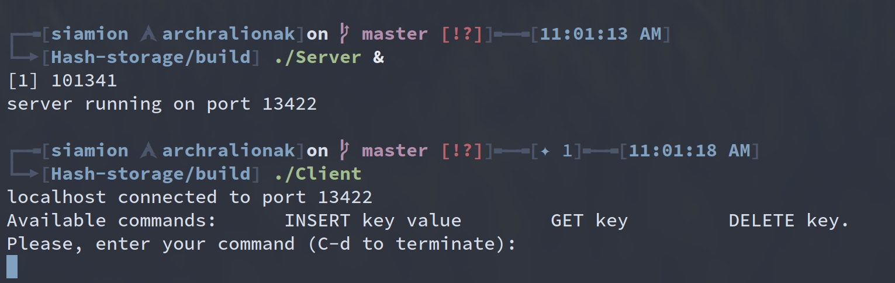
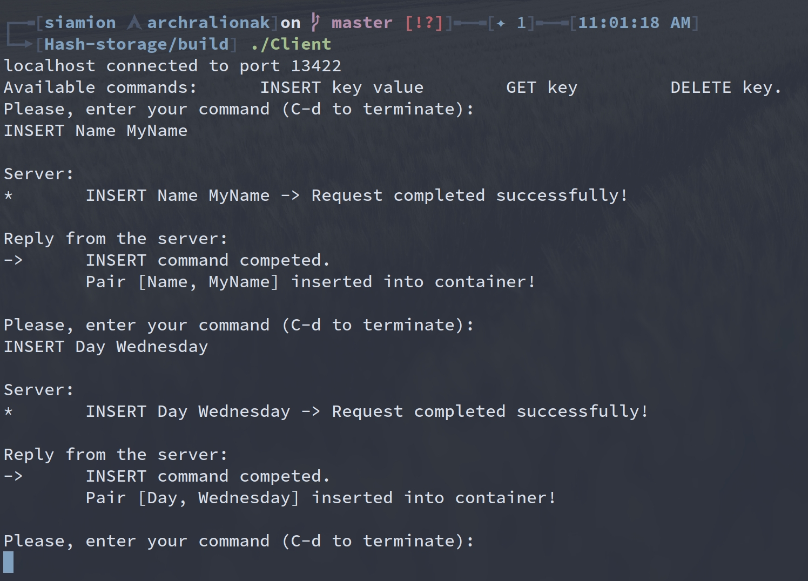
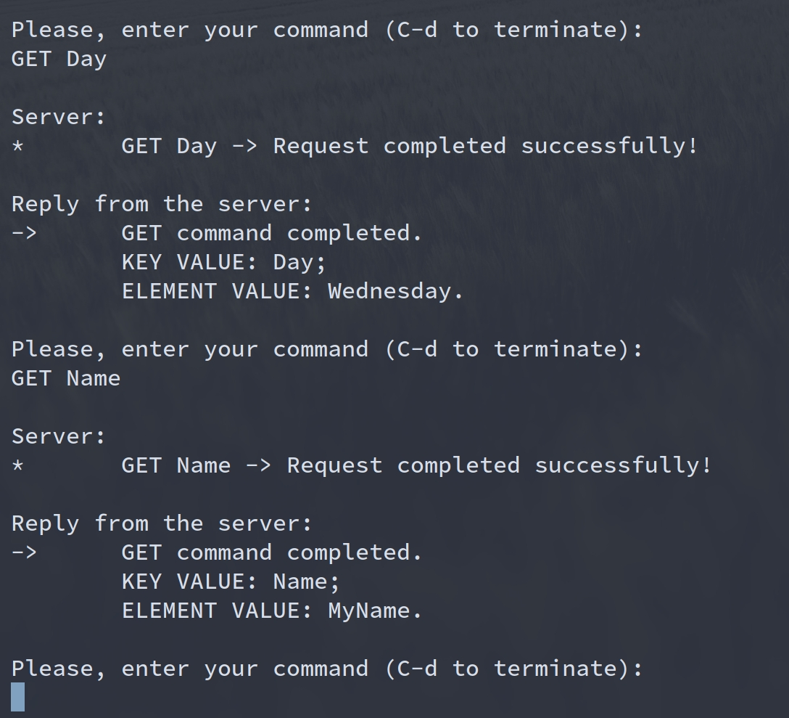
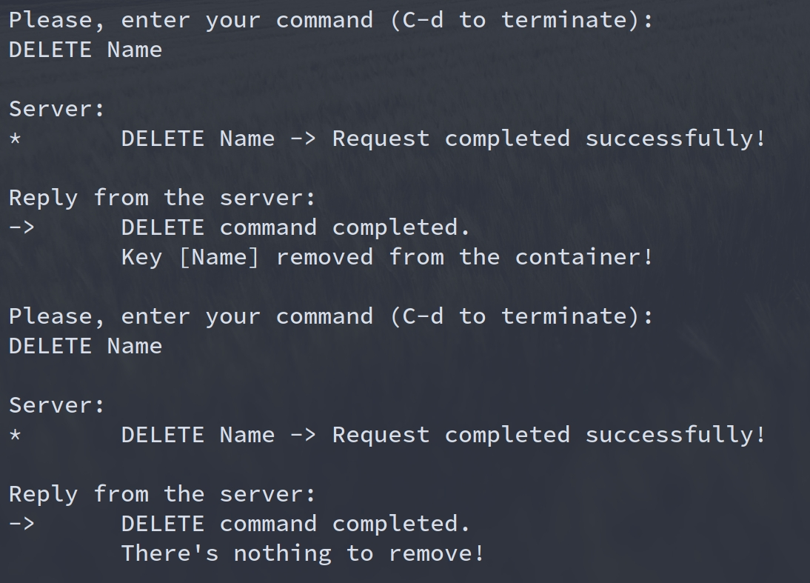
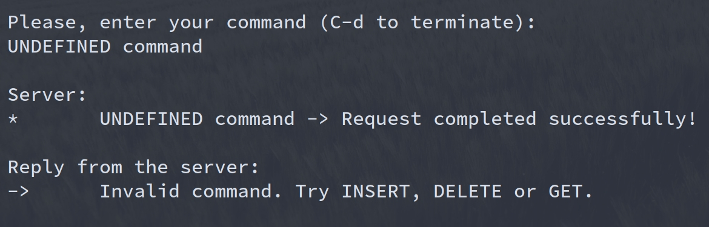

# Client-Server C++ application (using Asio Library)

This is the code repository for my mini-project.

## Getting Started

<blockquote>
	OS: Linux (Arch Linux 5.6.8) <br>
	Compiler: GCC (9.3.0) <br>
</blockquote>

First of all, you'll need to download standalone [Asio Library](https://github.com/chriskohlhoff/asio).
No matter what your Linux distribution, it can easily be installed according to your package manager:

```bash
sudo pacman -S asio
sudo apt-get install asio
```

Clone the repository:

```bash
git clone https://github.com/SiamionRalionak/Hash-storage.git
```

## Compilation

For server:

```bash
g++ -std=c++17 -pthread -Wall -Wextra -Wshadow -pedantic -o build/Server source/Server.cpp
```

For client:

```bash
g++ -std=c++17 -pthread -Wall -Wextra -Wshadow -pedantic -o build/Client source/Client.cpp
```


## Usage

```bash
cd build
./Server &
./Client
```

## Screenshots

# Run Server & Client

<p align="center"></p>

# INSERT command

<p align="center"></p>

# GET command

<p align="center"></p>

# DELETE command

<p align="center"></p>

# Invalid command

<p align="center"></p>
